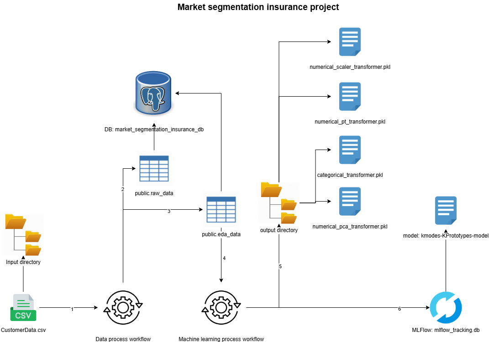

# Market segmentation insurance project

This project consists of implementing a process that joins ETL and machine learning pipelines using python and Docker.

## Workflow



Steps:

1. Create PostgreSQL instance.
2. Data process pipeline (ETL):
    * Create tables.
    * Read data from CSV file from input directory.
    * Save raw data into a public.raw_data table.
    * Apply cleaning and transformation process.
    * Save cleaned data into public.eda_Data table.
3. Machine learning pipeline:
    * Read data from public.eda_Data table.
    * Apply data preparation (cleaning, scaling, dimensionality reduction, etc).
    * Save data transformers into output directory.
    * Train model using KPrototypes.
    * Save models using MLFlow.

## Docker specifications

There are three images:

1. postgres, which can be downloaded from Docker hub.
2. wilderjoseth/market-segmentation-insurance-data-process, this image can be downloaded from Docker hub or created from Dockerfile.
3. wilderjoseth/market-segmentation-insurance-ml-process, this image can be downloaded from Docker hub or created from Dockerfile.

Requirements:

* input docker volume.
* output docker volume.
  * transformers directory.
* DB_PASSWORD: enviroment variable

### Some Docker commands

```bash
# Start docker process
docker compose up
```

```bash
# Create data process image
docker build -t wilderjoseth/market-segmentation-insurance-data-process .
```

```bash
# Create ml process image
docker build -t wilderjoseth/market-segmentation-insurance-ml-process .
```
